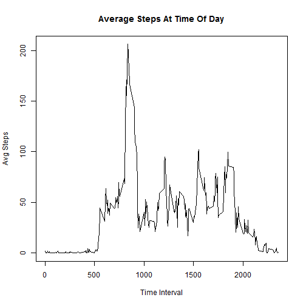
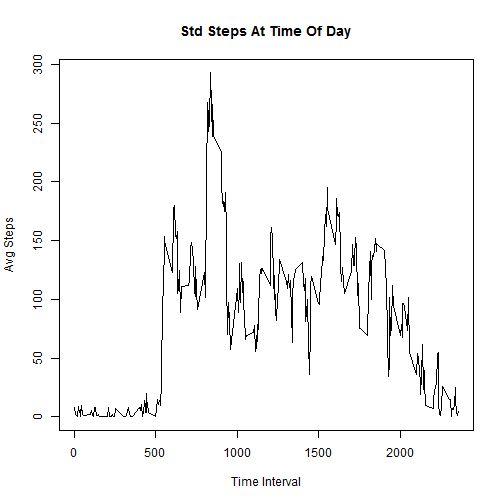

## Loading and preprocessing the data

This routine assumes the activity.csv data file is in the data/ subdirectory.

Read in the data set and modify the dates to character strings

```r
fileName = "data/activity.csv"
data <- read.csv(fileName)
data$date <- as.character(data$date)
```

Create a second ata set without the NAs called data_na

```r
data_na <- subset(data, !is.na(data$steps))
```

## What is mean total number of steps taken per day?

Create a data set, number_of_steps, which is the total number of steps per day

```r
number_of_steps <-numeric()
days <- unique(data_na$date)
for (i in days){
    day_subset <- subset(data_na, data_na$date == i)
    
    t_sum <- sum(day_subset$steps)
    number_of_steps <- c(number_of_steps, t_sum)
}
```
Graph the distribution of steps per day

```r
hist(number_of_steps)
```

 

What are the mean and median number of steps

'''{R}
mean(number_of_steps); median(number_of_steps)
```
Mean and median are fairly close, so it looks like there is not too much skew to the data.


## What is the average daily activity pattern?

Create a dataset, interval_result, which is the average steps per time interval


```r
interval_result <- data.frame()
interval <- unique(data_na$interval)
for (i in interval){
    interval_subset <- subset(data_na, data_na$interval == i)
    
    t_avg <- mean(interval_subset$steps)
    interval_result <- rbind(interval_result, data.frame(interval=i, steps=t_avg))
}
```
Plot activity per time interval


```r
plot(interval_result$interval, interval_result$steps, xlab="Time Interval", ylab="Avg Steps", main="Average Steps At Time Of Day", type="l")
```

 

## Imputing missing values


```r
interval_result <- data.frame()
interval <- unique(data_na$interval)
for (i in interval){
    interval_subset <- subset(data_na, data_na$interval == i)
    
    t_avg <- sd(interval_subset$steps)
    interval_result <- rbind(interval_result, data.frame(interval=i, steps=t_avg))
}
```


```r
plot(interval_result$interval, interval_result$steps, xlab="Time Interval", ylab="Avg Steps", main="Std Steps At Time Of Day", type="l")
```

 

## Are there differences in activity patterns between weekdays and weekends?

We need to create a new factor of weekday or weekend from day of week

```r
day_type <- as.Date(data_na$date)
day_type <- weekdays(day_type)
day_type <- gsub("Monday", "Weekday", day_type)
day_type <- gsub("Tuesday", "Weekday", day_type)
day_type <- gsub("Wednesday", "Weekday", day_type)
day_type <- gsub("Thursday", "Weekday", day_type)
day_type <- gsub("Friday", "Weekday", day_type)
day_type <- gsub("Saturday", "Weekend", day_type)
day_type <- gsub("Sunday", "Weekend", day_type)

data_days <- cbind(data_na, day_type)
```
Compute the average 


```r
interval_result <- data.frame()
interval <- unique(data_days$interval)
days <- unique(data_days$day_type)
for (k in days){
    day_subset <- subset(data_days, data_days$day_type == k)
    
    for (i in interval){
        interval_subset <- subset(day_subset, day_subset$interval == i)
    
        t_avg <- mean(interval_subset$steps)
        interval_result <- rbind(interval_result, data.frame(interval=i, day=k, steps=t_avg))
    }
}
```

For this graph, we need to load teh gplot2 library

```r
library(ggplot2)
```

And plot the results


```r
g<-ggplot(interval_result, aes(interval, steps)) + geom_line() + facet_grid(.~day) + labs(title="Weekday vs Weekend Activity")
print(g)
```

 
