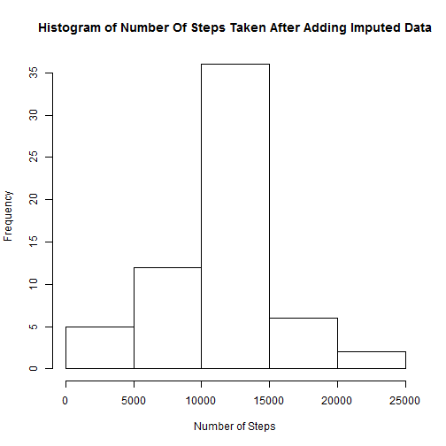

## Loading and preprocessing the data

This routine assumes the activity.csv data file is in the data/ subdirectory.

Read in the data set and modify the dates to character strings

```r
fileName = "data/activity.csv"
data <- read.csv(fileName)
data$date <- as.character(data$date)
```

The data set has 17,568 rows with three fields:
- **steps**, the number of steps during the time interval
- **date**, the date of the observations
- **interval**, the 5 mins time interval

Create a second dataset without the NAs called: **data_na**

```r
data_na <- subset(data, !is.na(data$steps))
```

## What is mean total number of steps taken per day?

Create a data set: number_of_steps, which is the total number of steps per day

```r
number_of_steps <-numeric()
days <- unique(data_na$date)
for (i in days){
    day_subset <- subset(data_na, data_na$date == i)
    
    t_sum <- sum(day_subset$steps)
    number_of_steps <- c(number_of_steps, t_sum)
}
```

Graph the distribution of steps per day


```r
hist(number_of_steps, main="Histogram of Number of Steps without NAs", xlab="Number of Steps")
```

 

What are the mean and median number of steps?


```r
mean(number_of_steps)
```

```
## [1] 10766.19
```


```r
median(number_of_steps)
```

```
## [1] 10765
```
Mean and median are fairly close, so it looks like there is not too much skew to the data.


## What is the average daily activity pattern?

Create a dataset: interval_result, which is the average steps per time interval. Measurements are recorded at 5 mint intervals throughout the day.


```r
interval_result <- data.frame()
interval <- unique(data_na$interval)
for (i in interval){
    interval_subset <- subset(data_na, data_na$interval == i)
    
    t_avg <- mean(interval_subset$steps)
    interval_result <- rbind(interval_result, data.frame(interval=i, steps=t_avg))
}
```
Plot activity per time interval


```r
plot(interval_result$interval, interval_result$steps, xlab="Time Interval", ylab="Avg Steps", main="Average Steps At Time Of Day", type="l")
```

 

Which interval has the **maximum average activity**?


```r
interval_result$interval[which(interval_result$steps == max(interval_result$steps), arr.ind=TRUE)]
```

```
## [1] 835
```

## Imputing missing values

Some of the observations have missing data. To fill in the data, we will use the average for the time interval, a simple, but fast, calculation.  A possible enhancement might be the average for the time interval according to the type of day (the significance of type of day will be shown later). The new dataset: **data_impute**, will have the same dimensions as the original dataset, 17568 rows.


```r
data_impute <- data.frame()
interval <- unique(data$interval)
for (i in interval){
    interval_subset <- subset(data, data$interval == i)
    
    t_mean <- mean(interval_subset$steps, na.rm=TRUE)
    interval_subset$steps[is.na(interval_subset$steps)] <- t_mean
    data_impute <- rbind(data_impute, interval_subset)
}
```
Regraph the histogram for total steps per day including the imputed data


```r
number_of_steps <-numeric()
days <- unique(data_impute$date)
for (i in days){
    day_subset <- subset(data_impute, data_impute$date == i)
    
    t_sum <- sum(day_subset$steps)
    number_of_steps <- c(number_of_steps, t_sum)
}
```
Graph the distribution of steps per day to see if it has changed


```r
hist(number_of_steps, main="Histogram of Number Of Steps Taken After Adding Imputed Data", xlab="Number of Steps")
```

 

The shaoe of the histogram has not changed and some of the frequency observations have increased since there are more of them. However, we would not expect a change in the overall mean since it was the value used to impute the NAs.

Now let's see how the mean and median have changed after adding the imputed steps per day


```r
mean(number_of_steps)
```

```
## [1] 10766.19
```

```r
median(number_of_steps)
```

```
## [1] 10766.19
```

The median has moved closer to the mean.


## Are there differences in activity patterns between weekdays and weekends?

To answer this question, we need to create another factor which is either Weekday or Weekend, and apply it to the the data with imputed step values.  This will be a new column called: **day_type**


```r
day_type <- as.Date(data_impute$date)
day_type <- weekdays(day_type)
day_type <- gsub("Monday", "Weekday", day_type)
day_type <- gsub("Tuesday", "Weekday", day_type)
day_type <- gsub("Wednesday", "Weekday", day_type)
day_type <- gsub("Thursday", "Weekday", day_type)
day_type <- gsub("Friday", "Weekday", day_type)
day_type <- gsub("Saturday", "Weekend", day_type)
day_type <- gsub("Sunday", "Weekend", day_type)

data_days <- cbind(data_impute, day_type)
```
Compute the average across day_type


```r
interval_result <- data.frame()
interval <- unique(data_days$interval)
days <- unique(data_days$day_type)
for (k in days){
    day_subset <- subset(data_days, data_days$day_type == k)
    
    for (i in interval){
        interval_subset <- subset(day_subset, day_subset$interval == i)
    
        t_avg <- mean(interval_subset$steps)
        interval_result <- rbind(interval_result, data.frame(interval=i, day=k, steps=t_avg))
    }
}
```

For this graph, we need to load the ggplot2 library

```r
library(ggplot2)
```

And plot the Weekday and Weekend results side by side (since it is easier to read than up and down)


```r
g<-ggplot(interval_result, aes(interval, steps)) + 
      geom_line() + 
      facet_grid(.~day) + 
      labs(title="Weekday vs Weekend Activity")
print(g)
```

 

The graphs show that activity generally starts later in the day on the Weekends, but is more consistent throughout the day and further into the evening than on the Weekdays.

